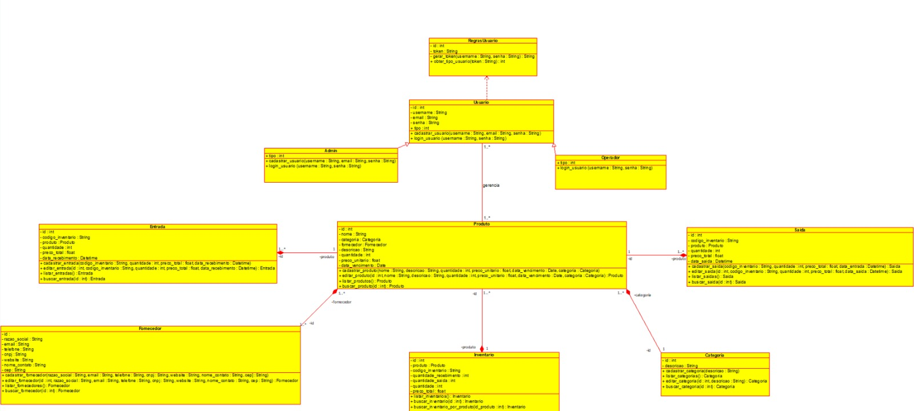
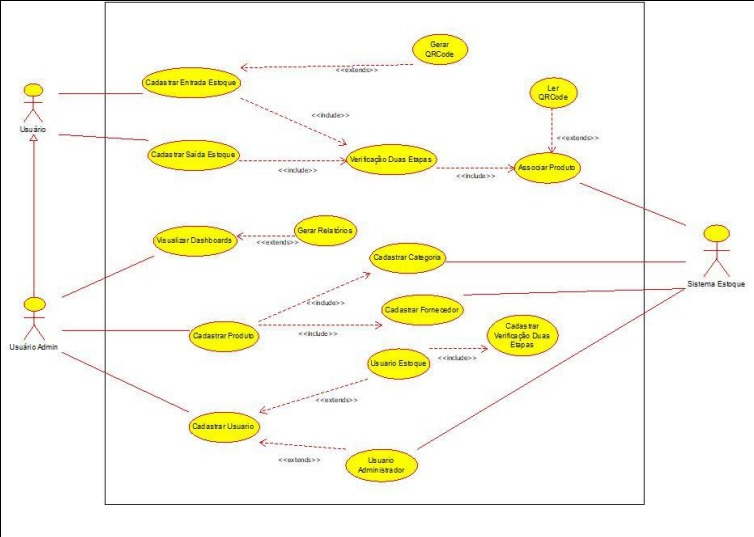
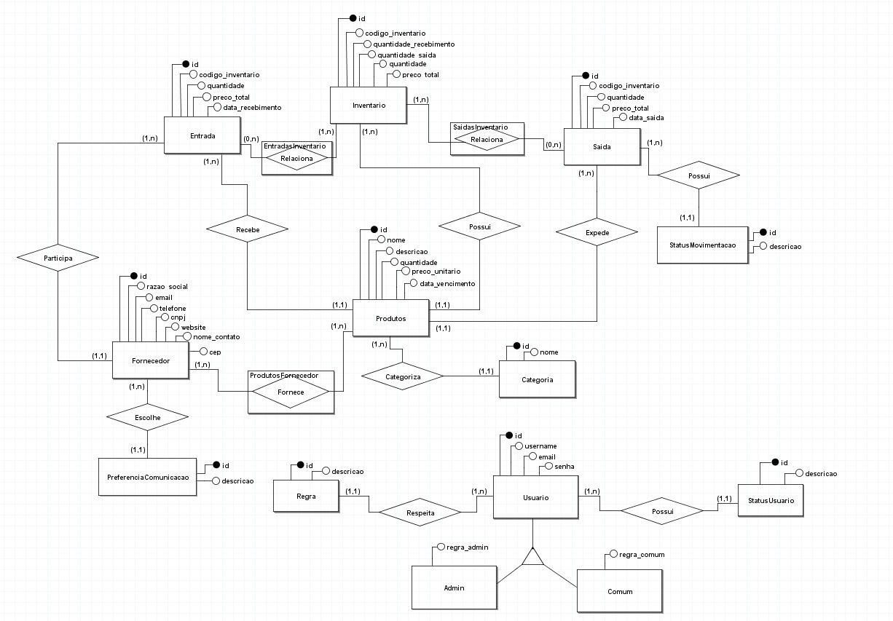
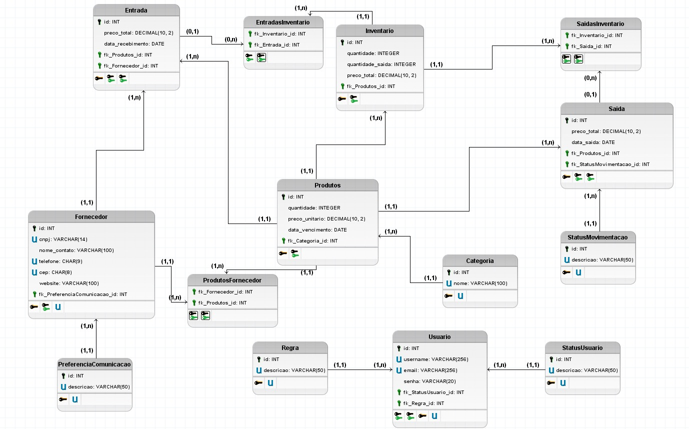

# Diagramas do Projeto

## 1. Diagrama de Classes
O Diagrama de Classes descreve as classes do sistema e seus relacionamentos. Ele é fundamental para entender a estrutura do código e as interações entre os objetos. 

- **Localização do arquivo:** `imagens/diagrama-classese.jpg`

## 2. Diagrama de Caso de Uso
O Diagrama de Caso de Uso mostra as interações entre os usuários e o sistema, representando os casos de uso mais importantes.

- **Localização do arquivo:** `imagens/diagrama-caso-de-uso.jpg`

## 3. Diagrama Entidade-Relacionamento (ER)
O Diagrama ER é utilizado para ilustrar a estrutura de banco de dados, incluindo entidades e os relacionamentos entre elas.

- **Localização do arquivo:** `imagens/diagrama-entidade-relacionamento.jpg`

## 4. Diagrama Lógico
O Diagrama Lógico detalha a organização e estrutura de dados do sistema, além das operações realizadas sobre eles.

- **Localização do arquivo:** `imagens/diagrama-logico.jpg`

---

Esses diagramas ajudam a entender a arquitetura e os processos envolvidos no sistema. Eles podem ser úteis para quem precisa se familiarizar com a estrutura do projeto e sua implementação.
